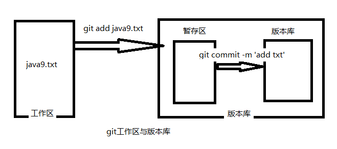

### [Git](https://git-scm.com/) 简单介绍
Git作为目前世界上先进的分布式版本控制系统，具有很多优秀的特性，是SVN所不能比拟的。简单来讲，Git有一下几点优点：
#### 分布式管理
相比较于集中式管理的弊端，比如：版本库存储在中央服务器，每次开发都必须先从中央服务器将本机代码更新为服务器版本。这就好像你每次干活之前，都要先申请使用最新的工具一样。这也无可厚非，但是网络出现问题无法获取最新的工作场景，就会给以后的开发带来许多困扰。作为分布式管理的Git，则无需担心这个问题。可以这样理解，Git实现了去中心化，也就是每个人工作空间的版本和服务器的版本是一样的，每个人的工作台都可以理解为服务器。开发完各自的功能就可以提交代码，push到远程服务器。同时也可以更新本地代码为远程服务器的最新版本，pull拉回本地。当然，冲突不可避免。
#### 分支策略
对于开发一个大型的应用，Git的分支管理则就派上了重大用场。对大型应用进行功能拆分，分解为几部分高内聚的功能，分发给相应的开发人员。此时不同的开发人员则就可以针对各自的功能部分从主分支拉取新分支进行开发，开发完成之后push到远程主分支，同时也可以pull拉取主分支上别人提交的代码。当然也可以将其他功能分支checkout到本地进行一些review等。除此之外，还可以针对bug进行临时拉取分支开发bug修复分支，修复完成后merge到主分支消除bug。

针对上述一些专业名词（push、pull、checkout等），将会逐渐讲解。  

### 配置Git
安装完git后，需要去[Github](https://github.com/)（俗称gayhub）注册账号，相当于在gay社区有一个自己gay的身份。这个gayhub是一个代码托管平台，可以将自己的代码托管到这个平台，相当于远程仓库，更通俗来讲，就是一个中央服务器。每个人都可以fork你的代码并clone到他们的主机。  
#### 配置信息设置
将自己的gay信息注册到本地git软件。这样你就可以将本地开发完的代码提交到远程主分支，也就是远程服务器。
```git
$ git config --global user.name "你的GitHub注册用户名"
$ git config --global user.email "你的GitHub注册邮箱"
```
这样就将你的信息注册到了本地git中。  
检查已有的配置信息：
```git
$ git config --list
```
#### 文件版本操作
一切准备就绪之后，我们就可以进行本地git的一顿操作啦。
* 初始化工作空间
创建一个文件夹作为项目的工作区，例如我在D盘创建了一个文件夹rushgit（创建文件夹命令：mkdir rushgit）。
```git
$ git init
```
此时，这个文件夹就成了我们git的一个工作区了。回头看一眼文件夹里面，git已经为我们生成了一个.git隐藏文件。对于这个git文件，它保存了我们整个工作区的版本历史、分支等一系列重要信息，尽量不要对它进行“操作”。
* 文件版本操作
有了工作空间，我们在此目录下进行的所有增删改查的操作都会被git“监控”并记录下来。接着我们随意创建一个文件并保存（touch java9.txt），文件中输入一行文本：“java 9于20177年9月21日正式发布。”。此时工作区已经发生了改变——添加了一个文件。此时我们输入git status（查看工作区的状态），让我们的小管家git告诉我们发生了什么：
```java
$ git status
on branch master
Initial commit
Untracked files:
      (use "git add <file>..." to include in what will be committed)
                    java9.txt
nothing added to commit but untracked files present (use "git add" to track)
```
此时git提醒我们，initial commit（初始提交）。Untracked files则是指java9.txt还未添加到git的版本控制区域，还未被追踪到。同时git还给出了我们接下来可能或者应该进行的操作，git add。将<file>添加进来提交。那么我们就跟着提示进行下一步。
* 将文件添加到暂存区  
从status中我们了解到我们整个工作区的状态属于待添加的状态，我们就将文件添加一下，看是将文件添加到哪里。  
```java
$ git add java9.txt         # 将文件java9.txt添加到本地版本库
$ git add *.txt             # 将所有*.txt添加到本地版本库
$ git add .                 # 将所有的子目录（不包含空目录）到本地版本库
```
此时再利用git status查看一下工作区的状态，提示则是提交初始化，意思就是可以提交了。但是提交到哪呢？
```java
On branch master
Initial commit
Changes to be committed:
  (use "git rm --cached <file>..." to unstage)
        new file:   java9.txt
```
这里就引入了git工作区和版本库的概念，如图：

  解释一下工作区和版本库的概念：通俗来讲，你编辑文本的整个目录，或者说你的整个工程项目，就是你的工作区。你在这里进行工程的开发。而版本库，则是你进行版本控制的地方，譬如你可以查看历史工作记录、操作回退等功能，有点类似于在此拥有ctrl+s、ctrl+z、ctrl+y的功能（针对版本而言）。当我们开发了一部分功能，可以使用***git add 文件名***将此部分工程添加到我们版本库的暂存区，可以认为这里是我们工程修改的一个中转站。使用***git commit -m '说明'*** 可以将暂存区的所有修改同步到版本库，也就是分支、主干管理处。
* 将文件添加到版本库
从上面我们了解到add之后的status为initial commit，从git的提示信息我们可以了解到，此时处理可以提交（commit）的状态。什么是commit？就是将本地暂存区的修改记录全部同步到版本库当中，这也就是如上图所示的暂存区到版本库的状态转移。
  1. -m "注释",git commit -m '此处为本次提交代码版本修改的注释'。
  2. -a 表示将所有已跟踪文件执行修改或删除的文件状态同步到版本库。
  3. -amend 表示追加提交，在不新增一个commit-id的情况下将新修改的代码追加到前一次的commit-id当中。

  一般我们只需要使用-m参数，显示指定当前提交的备注。比如：
```
$ git commit -m "add java9"
```
此时我们再执行git status查看我们版本库的状态：
```java
On branch master
nothing to commit, working directory clean
```
提示我们在分支master，当前没有需要提交的，工作区是干净的。这就完成了一次commie。此时可以通过git log查看提交记录，由于我们之提交了一次，所以会显示一次commit，并且跟着一串commit-id，这个commit-id可以追踪提交记录，每次提交都会产生新的一个commit-id用于标识本次的提交修改，以后会讲到根据commit-id来进行版本回退等的操作。

* 提交历史纪录  
上面提到，使用`git log`可以查看版本提交的历史记录。但是记录显示的会比较乱，如下：
```java
commit 68c86da5dc6372755fe7048847aed6cd9b8f001f  --- commit-id
Author: VfEver <******@***.com>                  --- 提交人
Date:   Mon Sep 24 00:49:54 2018 +0800           --- 提交日期

    add java9                                    --- 提交注释
```
从上面可以看到比较凌乱，尤其是在提交历史多了以后，更是不好定位。所以还有一个命令，使得我们查看版本提交记录更加简洁明了。如下：
```
$ git log --pretty=oneline
$ 68c86da5dc6372755fe7048847aed6cd9b8f001f add java9
```

### 总结
本小节我们主要学习了git的配置、暂存区、版本库的概念，以及添加到暂存区、版本库的常用命令。接下来我们主要将要接触远程仓库——和大家一起玩。
