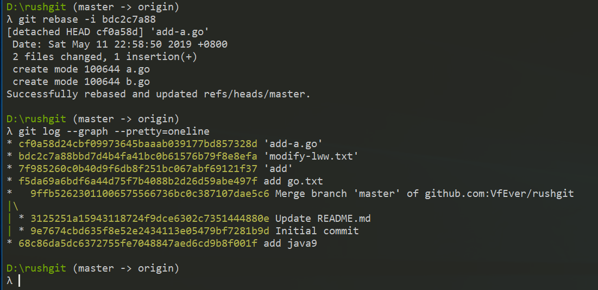
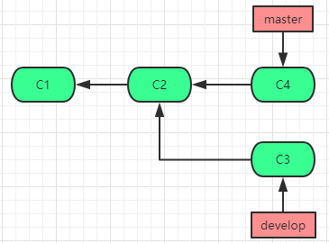
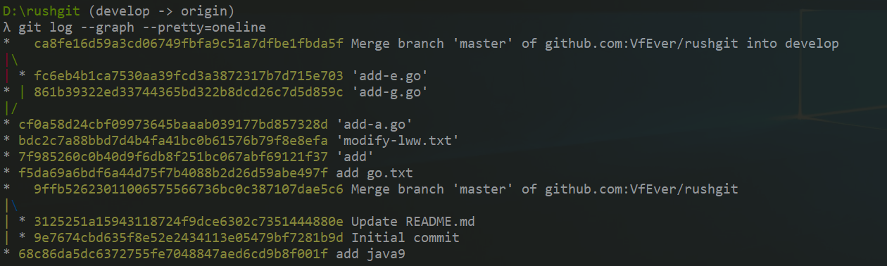
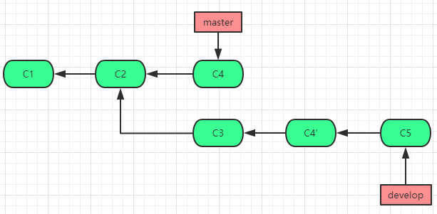
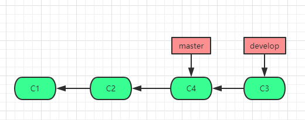
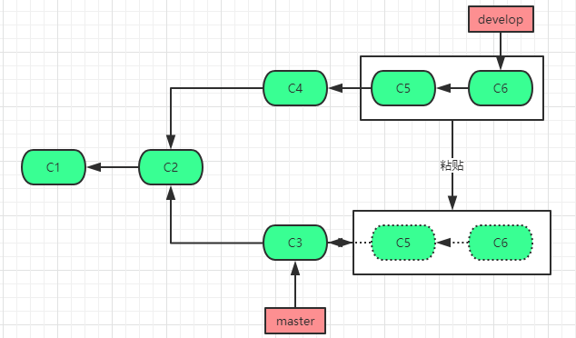

### reabse介绍
我们在使用git提交远程仓库，或者同步远程仓库代码到本地仓库，查看提交记录的时候，提交历史往往是一条分叉的树，这在多人协作开发的过程中是十分常见的。有没有办法使我们的提交干净整洁？提交记录更加简洁一点？这时候rebase派上用场。**git rebase** 有三个作用：1，合并多个commmit为一个完整的commit；2，将提交记录整洁干净；3，将某一段commit合并到另一个分支。接下来将详细介绍这三个作用的使用场景和用法。  
### rebase作用
#### 合并多个commit为一个完整的commit  
1.首先查看工作区状态，确保工作区、暂存区、版本库已经远程仓库一致。然后我们做一些普通的**add** 和**commit** 操作。  
```java
D:\rushgit (master -> origin)
λ git status      ##查看当前状态
On branch master
nothing to commit, working directory clean
D:\rushgit (master -> origin)
λ touch a.go      ##创建一个新文件a.go，添加到暂存区并提交到本地版本库
D:\rushgit (master -> origin)
λ git status
On branch master
Untracked files:
  (use "git add <file>..." to include in what will be committed)
        a.go
nothing added to commit but untracked files present (use "git add" to track)
D:\rushgit (master -> origin)
λ git add a.go
D:\rushgit (master -> origin)
λ git commit -m 'add-a.go'
[master ed0e588] 'add-a.go'
 1 file changed, 0 insertions(+), 0 deletions(-)
 create mode 100644 a.go
D:\rushgit (master -> origin)
λ touch b.go    ##创建一个新文件b.go，添加到暂存区并提交到本地版本库
D:\rushgit (master -> origin)
λ git add b.go
D:\rushgit (master -> origin)
λ git commit -m 'add-b.go'
[master 2c0c671] 'add-b.go'
 1 file changed, 0 insertions(+), 0 deletions(-)
 create mode 100644 b.go
D:\rushgit (master -> origin)
λ vim a.go    ##修改a.go文件的内容，添加到暂存区并提交到本地版本库
D:\rushgit (master -> origin)
λ git status
On branch master
Changes not staged for commit:
  (use "git add <file>..." to update what will be committed)
  (use "git checkout -- <file>..." to discard changes in working directory)
        modified:   a.go
no changes added to commit (use "git add" and/or "git commit -a")
D:\rushgit (master -> origin)
λ git add a.go
D:\rushgit (master -> origin)
λ git commit -m 'modify-a.go'
```
这时候图形化方式查看一下git的提交历史记录：
```java  
λ git log --graph --pretty=oneline
*409c288f44bcbcbcb3f2a9a91ac00b7967a2ec91 'modify-a.go'
*2c0c671f35f238a1367eea8681bcdcad82b4ba1d 'add-b.go'
*ed0e58875017a20e4c165f5e6746fe939a6f7ac7 'add-a.go'
```
可以看到本地版本库有三条提交记录，分别对应我们的三次提交。这三次的更改就是添加了a.go，b.go，并修改了a.go。当我们向远程关联分支提交的时候，可不可以合并成一个commit呢？就是通过rebase功能。  

2.使用**git rebase** 合并多个commit为一个commit，使本地版本仓库的提交记录简洁，提交到远程也更清晰。    
命令为git rebase -i [start commit-id] [end commit-id]。start commit-id和end commit-id按照字面意思就是开始id和结束id，也就是你想合并哪一段区间的提交。这个区间是前开后闭的，也就是如果你想合并3个commit的提交，那么start commit-id需要设置为倒数第四个commit-id。此处我们应该设置为**bdc2c7a88** 。    
```java
λ git rebase -i bdc2c7a88
pick ed0e588 'add-a.go'
pick 2c0c671 'add-b.go'
pick 409c288 'modify-a.go'
# Rebase bdc2c7a..409c288 onto bdc2c7a (3 command(s))
#
# Commands:
# p, pick = use commit
# r, reword = use commit, but edit the commit message
# e, edit = use commit, but stop for amending
# s, squash = use commit, but meld into previous commit
# f, fixup = like "squash", but discard this commits log message
# x, exec = run command (the rest of the line) using shell
# d, drop = remove commit
#
# These lines can be re-ordered; they are executed from top to bottom.
#
# If you remove a line here THAT COMMIT WILL BE LOST.
#
# However, if you remove everything, the rebase will be aborted.
#
# Note that empty commits are commented out
```
此时可以看到git给出了此次rebase的操作提示，在此给一下相关命令的解释：  
```java
1，p（pick）保留此commit
2，r（reword）保留此commit但是需要修改commit的注释
3，e（edit）保留该commit, 但要停下来修改该提交(不仅仅修改注释)
4，s（squash）将该commit和前一个commit合并
5，f（fixup）：将该commit和前一个commit合并，但不要保留该提交的注释信息
6，e（exec）：执行shell命令
7，d（drop）：要丢弃该commit（缩写:d）
```
此时如果我们只保留最后一个commit（409c28），其他两个commit直接和前一个commit合并，但是同时保留注释信息。这时候就修改命令行如下：   
```java
p ed0e588 'add-a.go'
s 2c0c671 'add-b.go'
s 409c288 'modify-a.go'     ##此时出现如下界面，提示我们即将完成的操作，可以继续修改commit相关信息。  
###################################################
# This is a combination of 3 commits.
# The first commits message is:
'add-a.go'
# This is the 2nd commit message:
'add-b.go'
# This is the 3rd commit message:
'modify-a.go'
# Please enter the commit message for your changes. Lines starting
# with '#' will be ignored, and an empty message aborts the commit.
#
# Date:      Sat May 11 22:58:50 2019 +0800
#
# interactive rebase in progress; onto bdc2c7a
# Last commands done (3 commands done):
#    s 2c0c671 'add-b.go'
#    s 409c288 'modify-a.go'
# No commands remaining.
# You are currently editing a commit while rebasing branch 'master' on 'bdc2c7a'.
#
# Changes to be committed:
#       new file:   a.go
#       new file:   b.go
#
```  
3.此时可以看到rebase的效果如下：
  
使用git log查看结果如下(reabase操作会生成一个新的commit-id来完成合并)：  
```java
λ git log
commit cf0a58d24cbf09973645baaab039177bd857328d
Author: VfEver <13146770925@126.com>
Date:   Sat May 11 22:58:50 2019 +0800
    'add-a.go'
    'add-b.go'
    'modify-a.go'
```
#### 简洁的提交记录，去除分叉
1.从当前分支新拉出来一个分支，取名为develop，然后从此分支做一个commit，然后在master分支做一个commit并提交。此时develop分支和远程master分支就有了分叉。
```java
D:\rushgit (master -> origin)
λ git status
On branch master
nothing to commit, working directory clean
D:\rushgit (master -> origin)
λ git checkout -b develop
Switched to a new branch 'develop'
D:\rushgit (develop -> origin)
λ touch c.go
D:\rushgit (develop -> origin)
λ git add c.go
D:\rushgit (develop -> origin)
λ git commit -m 'add-g.go'
[develop 861b393] 'add-g.go'
 1 file changed, 0 insertions(+), 0 deletions(-)
 create mode 100644 c.go
 D:\rushgit (master -> origin)
λ git checkout master  ##在此做一个add、commit、push（add commit省略）
 Switched to branch 'master'
λ git push
Counting objects: 6, done.
Delta compression using up to 4 threads.
Compressing objects: 100% (4/4), done.
Writing objects: 100% (6/6), 599 bytes | 0 bytes/s, done.
Total 6 (delta 1), reused 0 (delta 0)
remote: Resolving deltas: 100% (1/1), done.
To git@github.com:VfEver/rushgit.git
   bdc2c7a..fc6eb4b  master -> master
```  
  
2.此时如果我们在develop分支pull一下，将远程分支的提交同步到本地develop分支：
```java
D:\rushgit (develop -> origin)
λ git pull origin master
From github.com:VfEver/rushgit
 * branch            master     -> FETCH_HEAD
Merge made by the 'recursive' strategy.
 e.go | 0
 1 file changed, 0 insertions(+), 0 deletions(-)
 create mode 100644 e.go
```
此时的pull操作还会产生一个commit-id，现在的分支树用图形表示如下：
  
可以看到develop和远程master合并之后，产生了一个新的commit-id（ca8fe16），同时合并了远程的仓库提交历史，并产生了分叉。此时本地develop分支结果如下：  
  
3.如何解决这个分叉？就是接下来rebase的操作，我们先将本地develop分支回滚到上一个版本。
```java
D:\rushgit (develop -> origin)
λ git reset --hard 861b3
HEAD is now at 861b393 'add-g.go'
D:\rushgit (develop -> origin)
λ git log
commit 861b39322ed33744365bd322b8dcd26c7d5d859c
Author: VfEver <13146770925@126.com>
Date:   Sun May 12 09:25:23 2019 +0800
    'add-g.go'
commit cf0a58d24cbf09973645baaab039177bd857328d
```
此时我们进行rebase操作，将master分支合并到本地develop分支：
```java
λ git rebase fc6eb4b1
First, rewinding head to replay your work on top of it...
Applying: 'add-g.go'
λ git log --pretty=oneline
f5c7f65eacd5f7f93747698d436f8c764ec4e916 'add-g.go'
fc6eb4b1ca7530aa39fcd3a3872317b7d715e703 'add-e.go'
cf0a58d24cbf09973645baaab039177bd857328d 'add-a.go'
bdc2c7a88bbd7d4b4fa41bc0b61576b79f8e8efa 'modify-lww.txt'
7f985260c0b40d9f6db8f251bc067abf69121f37 'add'
f5da69a6bdf6a44d75f7b4088b2d26d59abe497f add go.txt
9ffb52623011006575566736bc0c387107dae5c6 Merge branch 'master' of github.com:VfEver/rushgit
3125251a15943118724f9dce6302c7351444880e Update README.md
9e7674cbd635f8e52e2434113e05479bf7281b9d Initial commit
68c86da5dc6372755fe7048847aed6cd9b8f001f add java9
```
此时的develop分支提交树则变成了如下（一条干净整洁的直线）：

#### 将某一段commit合并到另一个分支
  
如图我想将处于develop分支的C5到C6的提交粘贴至master分支，这个时候通过rebase功能也可以达到这个效果。
1.checkout develop分支，在develop分支做三次commit（C4、C5、C6）。之后在master分支做一个C3的commit。
```java
D:\rushgit (develop -> origin)
λ touch z.sh
D:\rushgit (develop -> origin)
λ git add z.sh
D:\rushgit (develop -> origin)
λ git commit -m 'add-z.sh'
[develop 16c1602] 'add-z.sh'
 1 file changed, 0 insertions(+), 0 deletions(-)
 create mode 100644 z.sh
D:\rushgit (develop -> origin)
λ touch x.sh
D:\rushgit (develop -> origin)
λ git add x.sh
D:\rushgit (develop -> origin)
λ git commit -m 'add-x.sh'
[develop 298bf3a] 'add-x.sh'
 1 file changed, 0 insertions(+), 0 deletions(-)
 create mode 100644 x.sh
D:\rushgit (develop -> origin)
λ touch c.sh
D:\rushgit (develop -> origin)
λ git add c.sh
D:\rushgit (develop -> origin)
λ git commit -m 'add-c.sh'
[develop 5d2f6c0] 'add-c.sh'
 1 file changed, 0 insertions(+), 0 deletions(-)
 create mode 100644 c.sh
D:\rushgit (develop -> origin)
λ git checkout master
Switched to branch 'master'
Your branch is up-to-date with 'origin/master'.
D:\rushgit (master -> origin)
λ touch v.sh
D:\rushgit (master -> origin)
λ git add v.sh
D:\rushgit (master -> origin)
λ git commit -m 'add-v.sh'
[master 7978153] 'add-v.sh'
 1 file changed, 0 insertions(+), 0 deletions(-)
 create mode 100644 v.sh
```
2.此时在master分支，将develop分支的C5-C6的提交粘贴至当前分支，就是使用**git rebase [start commit-id] [end commit-id]  --onto  [branchName]** 。同上，这个起止点也是一个左开右闭区间，所以起点要前进一个，也就是git rebase C4 C6 --onto master。
```java
D:\rushgit (develop -> origin)
λ git rebase 16c1602 5d2f6c --onto master
First, rewinding head to replay your work on top of it...
Applying: 'add-x.sh'
Applying: 'add-c.sh'
D:\rushgit (HEAD detached at 4ebf303 -> origin)
```
此时HEAD指向了4ebf303（当前的HEAD可以认为是一个游离的HEAD），一个新的commit-id。此时master分支HEAD其实并没有指向当前粘贴过来的现在的commit-id。当我们试图切回master分支的时候，会给我们一个提示：
```java
λ git checkout master
Warning: you are leaving 2 commits behind, not connected to
any of your branches:

  4ebf303 'add-c.sh'
  57f109c 'add-x.sh'
If you want to keep them by creating a new branch, this may be a good time
to do so with:
 git branch <new-branch-name> 4ebf303
Switched to branch 'master'
Your branch is ahead of 'origin/master' by 1 commit.
  (use "git push" to publish your local commits)
```
提示显示，此时正在丢弃两个提交，而且这两个提交并没有关联到任何分支。我们也可以通过命令**git branch <new-branch-name> 4ebf303**通过新建一个分支完成关联。此时切回master分支，也可以通过**git reset --hard 4ebf303**完成master分支的HEAD指向4ebf303。
```java
D:\rushgit (master -> origin)
λ git reset --hard  797815
HEAD is now at 7978153 'add-v.sh'
λ git log --pretty=oneline
4ebf303885c1c4e3a034b4b3fd2ad8ff0debff74 'add-c.sh'
57f109c8ea5805bfdaee7631eb2575ff71317a49 'add-x.sh'
79781531517c9f834564f9a43ef213e90cc74156 'add-v.sh'
584b02b6bc55a76b50f83a466f505ee08ad6d189 'add-w.go'
fc6eb4b1ca7530aa39fcd3a3872317b7d715e703 'add-e.go'
cf0a58d24cbf09973645baaab039177bd857328d 'add-a.go'
bdc2c7a88bbd7d4b4fa41bc0b61576b79f8e8efa 'modify-lww.txt'
7f985260c0b40d9f6db8f251bc067abf69121f37 'add'
f5da69a6bdf6a44d75f7b4088b2d26d59abe497f add go.txt
9ffb52623011006575566736bc0c387107dae5c6 Merge branch 'master' of github.com:VfEver/rushgit
3125251a15943118724f9dce6302c7351444880e Update README.md
9e7674cbd635f8e52e2434113e05479bf7281b9d Initial commit
68c86da5dc6372755fe7048847aed6cd9b8f001f add java9
```
这就完成了C5、C6到master分支C3后的粘贴。如果使用简单的**git rebase [branch-name]**，就是单纯将branch-name的分支上提交的代码复制到当前分支，当前的分支提交在后（也就是作为最新的commit添加在从其他分支粘贴过来的提交之后）。

### 参考链接
1. https://www.codercto.com/a/43072.html
2. http://gitbook.liuhui998.com/4_2.html
3. https://www.jianshu.com/p/4a8f4af4e803
