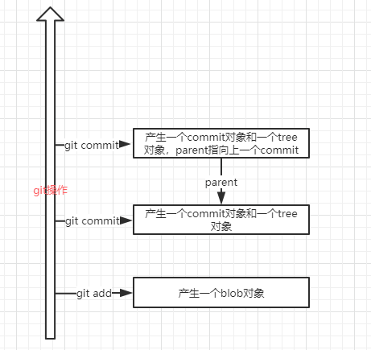

### .git目录
使用Git作为一个版本库，管理代码版本信息和历史记录。在一个工作区当中，我们可以通过ctrl+z、ctrl+y完成内存历史版本的更替，git是如何做到分支管理、版本管理的呢？这就涉及到了git工作空间里隐藏的.git目录，git通过这个隐藏目录实现了分支、版本的状态记录以及切换。
### 概念
在介绍git如何做到分支切换、版本管理之前，首先要介绍下git对象相关的概念。对象库是Git版本库实现的核心。它包含原始数据文件和所有日志消息、作者信息、日期、以及其他用来重建项目任意版本或分支的信息。Git放在对象库里的对象只有4种类型：块(blob)、目录树(tree)、提交(commit)和标签(tag)。就是由这4种对象构成Git高层数据结构的基础。
#### 块 - blob
文件的每一个版本表示为一个块(blob)。一个blob保存一个文件的数据，但不包含任何关于这个文件的元数据，甚至连文件名也没有。
#### 目录树 - tree
一个目录树对象代表一层目录信息，它记录blob标识符、路径名和在一个目录里所有文件的一些元数据。
#### 提交 - commit
一个提交对象保存版本库中一次变化的元数据，包括作者、提交者、提交日期和日志消息。每一个提交对象指向一个目录树对象，而这个目录树对象在一张完整的快照中捕获提交时版本的状态。
#### 标签 - tag
一个标签对象分配一个任意的且人类可读的名字给一个特定对象，通常是一个提交对象。
### 操作.git目录
#### .git目录介绍
新建一个目录作为git仓库，通过**git init**初始化git仓库。可以看到当前版本库里面是有.git目录，里面包含HEAD，config，description和branches、hooks、info、objects、refs五个文件夹。
```java
D:\
λ mkdir gittest
D:\
λ cd gittest\
D:\gittest
λ git init
Initialized empty Git repository in D:/gittest/.git/
D:\gittest (master -> origin)
λ ls -al
total 12
drwxr-xr-x 1 zys 197609 0 May 26 16:59 ./
drwxr-xr-x 1 zys 197609 0 May 26 16:59 ../
drwxr-xr-x 1 zys 197609 0 May 26 16:59 .git/
```
进入.git目录可以看到里面这个隐藏目录里面控制版本以及各类元属性信息，如下：
```java
λ cd .git\
D:\gittest\.git (master -> origin)
λ ls -al
total 11
drwxr-xr-x 1 zys 197609   0 May 26 16:59 ./
drwxr-xr-x 1 zys 197609   0 May 26 16:59 ../
-rw-r--r-- 1 zys 197609  23 May 26 16:59 HEAD
-rw-r--r-- 1 zys 197609 157 May 26 16:59 config
-rw-r--r-- 1 zys 197609  73 May 26 16:59 description
drwxr-xr-x 1 zys 197609   0 May 26 16:59 hooks/
drwxr-xr-x 1 zys 197609   0 May 26 16:59 info/
drwxr-xr-x 1 zys 197609   0 May 26 16:59 objects/
drwxr-xr-x 1 zys 197609   0 May 26 16:59 refs/
D:\gittest\.git (master -> origin)
λ tree
D:.
├─hooks
├─info
├─objects
│  ├─info
│  └─pack
└─refs
    ├─heads
    └─tags
```
1，HEAD文件是当前分支的指向，比如当前分支指向master，则存储了对master的引用。
2，config文件存储了一些配置信息，属于配置文件。此处不细细描述。  
3，hooks/存储了一些钩子脚本，暂时不表。  
4，info文件夹是全局性排除文件，它和.gitignore是互补的。里面就一个exclude文件。
5，objects文件里面存放了所有的数据。
6，refs文件存放了提交对象的指针。
#### 实践
HEAD存放了当前分支指向，当我们主动修改HEAD文件的指向，也是相当于切换分支**checkout branch-name**。
```java
D:\gittest\.git (master -> origin)
λ cat HEAD
ref: refs/heads/master
#修改HEAD内容完成切换分支功能
D:\gittest\.git (develop -> origin)
λ echo 'ref: refs/heads/develop' > HEAD
D:\gittest\.git (develop -> origin)
```
目前objects、refs目录是空的，我们在版本仓库里面添加一个文件并做一次add操作，看下这两个目录的变化。
```java
D:\gittest (master -> origin)
λ echo "v1" > v1.txt
D:\gittest (master -> origin)
λ git status
On branch master
Initial commit
Untracked files:
  (use "git add <file>..." to include in what will be committed)
        v1.txt
nothing added to commit but untracked files present (use "git add" to track)
D:\gittest (master -> origin)
λ git add v1.txt
D:\gittest\.git (master -> origin)
λ tree
D:.
├─hooks
├─info
├─objects
│  ├─aa
│  ├─info
│  └─pack
└─refs
    ├─heads
    └─tags
```
可以看到，objects目录下面多了一个aa的文件夹。在介绍多出来的aa文件夹之前，先介绍git常用的两个命令。1，计算文件的SHA-1校验和**git hash-object filename**；2，查看对象（上文提到）的内容和类型**git cat-file -p/-t filename**。我们看一下刚才新添加的文件的SHA-1：
```java
D:\gittest (master -> origin)
λ git hash-object v1.txt
aa67cc0c2694dd2e15ebd35464e04b266b72850c
```
刚才我们创建的v1.txt文件的SHA-1为aa开头的67c...，开头与objects新增的文件夹名相同。进入到新增的文件夹看下文件目录，看到文件夹下有67cc0c2694dd2e15ebd35464e04b266b72850c的文件。这个文件和上一级文件夹组成了新增文件的SHA-1的值。这就说明了，当我们add一个文件到暂存区的时候，git会创建一个对应的objects，两级目录，前两位作为objects下面的一级目录，后面的数值作为二级文件名。通过**cat-file**可以查看文件的类型和内容。可以看到，aa67cc0c是一个blob块类型，指向了本次添加到暂存区的内容。
```java
D:\gittest\.git\objects (master -> origin)
λ cd aa
D:\gittest\.git\objects\aa (master -> origin)
λ ls
67cc0c2694dd2e15ebd35464e04b266b72850c
D:\gittest\.git\objects\aa (master -> origin)
λ git cat-file -t aa67cc0c
blob
D:\gittest\.git\objects\aa (master -> origin)
λ git cat-file -p aa67cc0c
"v1"
```
当我们将暂存区新增的这个文件添加到本地版本库时，可以观察到.git目录又有了新的变化。发现新增了两个文件夹。 使用**git log --pretty=oneline**可以查看提交的commit-id。
```java
D:\gittest (master -> origin)
λ git commit -m 'addv1'
[master (root-commit) 3ed76ec] 'addv1'
 1 file changed, 1 insertion(+)
 create mode 100644 v1.txt
D:\gittest (master -> origin)
λ cd .git\
D:\gittest\.git (master -> origin)
λ ls
COMMIT_EDITMSG  HEAD  config  description  hooks/  index  info/  logs/  objects/  refs/
D:\gittest\.git (master -> origin)
λ tree
D:.
├─hooks
├─info
├─logs
│  └─refs
│      └─heads
├─objects
│  ├─09
│  ├─3e
│  ├─aa
│  ├─info
│  └─pack
└─refs
    ├─heads
    └─tags
D:\gittest\.git (master -> origin)
λ git log --pretty=oneline
3ed76ec5a633c13942cdc205d8e82a83214ed4b5 'addv1'
D:\gittest\.git (master -> origin)
λ git cat-file -t 3ed76e
commit
D:\gittest\.git (master -> origin)
λ git cat-file -p 3ed76e
tree 09cd1fcab91850c07c5ef1f641652182eba9816d
author VfEver <13146770925@126.com> 1558878862 +0800
committer VfEver <13146770925@126.com> 1558878862 +0800
'addv1'
```
可以看到，刚才我们提交产生的objects（commmit-id 3ed76e）是一个commmit类型，这个commit类型的内容为我们提交的信息，包括作者信息、注释信息等。里面还有一个tree类型的对象。继续展开这个tree对象：
```java
D:\gittest\.git (master -> origin)
λ git cat-file -t 09cd1fcab
tree
D:\gittest\.git (master -> origin)
λ git cat-file -p 09cd1fcab
100644 blob aa67cc0c2694dd2e15ebd35464e04b266b72850c    v1.txt
```
可以看到最终tree类型对象内容为指向blob的指针，继续展开就是我们上文添加的文件内容。此时我们查看refs/heads中当前分支存储的内容，就会发现heads里面存储的就是当前分支指向的commit-id。
```java
D:\gittest\.git\refs\heads (master -> origin)
λ cat master
3ed76ec5a633c13942cdc205d8e82a83214ed4b5
```
再联系下上文我们提到的git中关键的各类对象，blob块对象存储了文件的数据，commit提交对象存储了当前提交的元数据信息（提交者、注释等），tree树对象则记录blob的标识符路径名等文件的元数据信息。我们继续做一次commit就可以看到tree相关的信息：
```java
D:\gittest (master -> origin)
λ echo "v2" > v2.txt
D:\gittest (master -> origin)
λ git add v2.txt
D:\gittest (master -> origin)
λ git commit -m 'addv2'
[master ca52c36] 'addv2'
 1 file changed, 1 insertion(+)
 create mode 100644 v2.txt
D:\gittest (master -> origin)
λ git log --pretty=oneline
ca52c3650a62d799aaa3b5608d037105fb1568c7 'addv2'
3ed76ec5a633c13942cdc205d8e82a83214ed4b5 'addv1'
D:\gittest (master -> origin)
λ git cat-file -p ca52c36
tree c2f43b16b1e7591fbeed8422c61cadab2aeb77ed
parent 3ed76ec5a633c13942cdc205d8e82a83214ed4b5
author VfEver <13146770925@126.com> 1558881909 +0800
committer VfEver <13146770925@126.com> 1558881909 +0800
'addv2'
D:\gittest (master -> origin)
λ git cat-file -t c2f43b16b
tree
D:\gittest (master -> origin)
λ git cat-file -p c2f43b16b
100644 blob aa67cc0c2694dd2e15ebd35464e04b266b72850c    v1.txt
100644 blob e08f1c7873bf3e22bef69f6bc96d6fc6bc5b617d    v2.txt
```
通过看第二次commit-id的内容信息，可以发现有一个parent，指向我们的第一次提交，也就是上一次提交。第一次提交的时候，是没有这个parent指针的。继续查看这次新产生的tree对象的内容，则记录了两条blob对象，一条第一次add v1的blob块对象，一条第二次add v2的blob块对象。也就是tree树对象仅仅存储了块对象的元属性信息。
如此，我们可以了解到git在add、commit的时候，产生的数据信息如下：  
  
