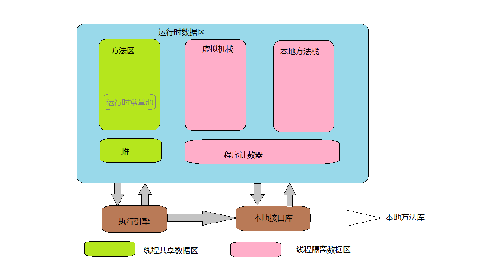

### JVM内存模型
JVM运行时数据区主要分为五大块：程序计数器、Java虚拟机栈、本地方法栈、堆和方法区。模型如下图:
#### 程序计数器
程序计数器可以看作是当前线程所执行字节码的行号指示器。虚拟机的字节码解释器工作时就是通过改变这个计数器的值来选取吓一跳需要执行的字节码指令，分支、循环、跳转、异常处理、线程恢复等基础功能都需要依赖这个计数器来完成。它是线程私有的，每条线程都有自己独立的程序计数器，为了保证线程切换后能恢复到正确的执行位置。

如果线程正在执行的是一个Java方法，这个计数器记录的是正在执行的虚拟机字节码指令的地址；如果正在执行的是Native方法，这个计数器值则为空（Undefined）。
#### Java虚拟机栈
Java虚拟机栈也是线程私有的，与线程的生命周期相同。描述的是Java方法执行的内存模型：每个方法在执行时会创建一个栈帧用于存储局部变量表、操作数栈、动态链接、方法出口等信息。方法的调用和返回对应栈帧在虚拟机中的入栈和出栈。

虚拟机栈有两种异常状况：1，如果线程请求的栈深度大于虚拟机所允许的深度，将抛出StackOverflowError异常。2，如果虚拟机可以动态扩展，扩展是无法申请到足够的内存，将抛出OutOfMemoryError异常。
#### 本地方法栈
本地方法栈与虚拟机栈类似，本地方法栈为虚拟机使用到的Native方法服务，也会抛出StackOverflowError或者OutOfMemoryError异常。
#### Java堆
Java堆是虚拟机所管理的内存中最大的一块，是被所有线程共享的一块内存区域，在虚拟机启动时创建。所有的对象实例和数组都在堆上分配。

Java堆是垃圾收集器管理的主要区域，在内存回收的角度来看，Java堆还可以细分为：新生代（Eden、From Survivor、To Suivivor）和老年代。

Java堆的内存空间类似与磁盘空间，逻辑上连续，物理上可以不连续。如果堆内存不能继续进行实例分配，将会抛出OutOfMemoryError异常。
#### 方法区（永久代）
方法区与Java堆一样，是各个线程共享的内存区域，用于存储已被虚拟机加载的类信息、常量、静态变量、即时编译器编译后的代码等数据。内存空间的分配与Java堆一样，逻辑上连续物理上不要求连续。

当方法区无法满足内存分配需求时，将抛出OutOfMemoryError异常。
#### 运行时常量池
运行时常量池是方法区的一部分。编译好的Class文件除了有类的版本、字段、方法、接口等描述信息外，还有一项信息是常量池，用于存放编译期生成的各种字面量和符号引用，这部分内容将在类加载后进入方法区的运行时常量池存放。
运行时常量池是方法区的一部分，受到方法区内存的限制，会抛出OutOfMemoryError异常。
