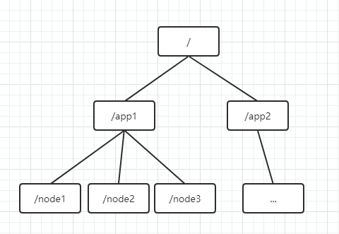

## 一、ZooKeeper是什么
ZooKeeper是一个分布式的、开放源码的分布式应用程序协调服务，是Google的Chubby一个开源实现。它是一个为分布式应用提供一致性服务的软件，提供了配置维护、域名服务、分布式锁、负载均衡、服务注册和发现等功能。
## 二、ZooKeeper的特性
1. 顺序一致性，从同一个客户端发起的事物请求，最终将会严格按照发起顺序被应用到ZooKeeper中。
2. 原子性，所有事物请求的处理结果在整个集群中所有机器上的应用情况是一致的，即整个集群要么都成功应用了某个事物，要么都没有应用。
3. 单一视图，无论客户端连接的是哪个ZooKeeper服务器，其看到的服务端数据模型都是一致的。
4. 可靠性，一旦服务端成功应用了一个事物，并完成对客户端的响应，那么该事物所引起的服务端状态变更将会一致被保留，除非有另一个事物对其进行了变更。
5. 实时性，ZooKeeper保证在一定的时间段内，客户端最终一定能从服务端上读取到最新的数据状态。  

## 三、ZooKeeper概念
### 3.1，数据节点Znode
ZooKeeper中的数据以一定的数据模型存储：整体数据以树形式具有层级关系，类似文件系统的数据模型。图示如下：  
    

#### 3.1.1，节点类型
ZK目录树中每个节点对应一个Znode。根据存活时间可以分为持久节点和临时节点。节点的类型在创建时就被确定下来，并且不能改变。持久节点的存活时间不依赖客户端会话，只有客户端在显式执行删除节点操作时，节点才会消失；临时节点的存活时间依赖于客户端会话，当会话结束，临时节点将会被自动删除（也可以手动删除）。利用临时节点的特性，我们可以用来进行集群管理，服务发现等。  
临时节点不能拥有子节点，持久节点可以有子节点。  
ZK还提供了顺序节点的节点类型。创建顺序节点时，ZK都会在路径后面自动添加10位数字（计数器），例如,<path>0000000001,<path>0000000002,......这个计数器可以保证在同一父节点下是唯一的。在ZK内部使用了4个字节的有符号整形来表示这个计数器。

#### 3.1.2，节点数据
创建节点的时候可以制定节点中存储的数据。ZK保证读和写都是原子操作，且每次读写操作都是对数据的完整读取或完整写入，并不提供对数据进行部分读取或者写入操作。以下命令创建一个节点/test/app，且其存储的数据为app。
```
create /test/app app
```
ZK虽然可以在节点存储数据，但是其定位并不是一个通用的数据库，不应该在节点存储过多的数据。ZK规定节点的数据大小不能超过1M。

#### 3.1.3，节点属性
每个Znode维护着各自一系列属性，通过get可以获得节点的属性：
```
get /test/app
app
cZxid = 0x20000000e
ctime = Thu Jun 30 20:41:55 HKT 2019
mZxid = 0x20000000e
mtime = Thu Jun 30 20:41:55 HKT 2019
pZxid = 0x20000000e
cversion = 0
dataVersion = 0
aclVersion = 0
ephemeralOwner = 0x0
dataLength = 4
numChildren = 0
```  
##### 版本号
对于每个Znode来讲，均存在三个版本号：
* dataVersion，数据版本号，每次对节点进行set操作其值都会增加1（即使设置的相同数据）
* cversion，子节点版本号，当znode的子节点有变化时，cversion的值就会增加1
* aclVersion，ACL的版本号，关于Znode的ACL（Access Control List，访问控制）

##### 事物ID
对于ZK来讲，每次变化都会产生一个唯一的事物ID，zid（ZooKeeper Transaction Id）。通过zxid可以确定更新操作的先后顺序。zxid1小于zxid2，说明zxid1操作先于zxid2发生。zxid对于整个ZooKeeper都是唯一的，即使操作的是不同的Znode。
* cZid，Znode创建的事物id
* mZid，Znode被修改的事物id，即每次对znode的修改都会更新mZxid。

##### 时间戳
包括Znode的创建时间和修改时间。
* ctime，Znode的创建时间，创建后不会改变
* mtime，Znode的修改时间，每次更新znode时都会发生变化

### 3.2，ZooKeeper集群
ZooKeeper是一个由多个server组成的集群，一个leader，多个follower。leader为客户端服务器提供读写服务，除了leader外其他的机器只能提供读服务。

#### 3.2.1，集群角色——leader
leader是整个ZK集群工作机制的核心，作为整个ZK集群的主节点，负责响应所有对ZK状态变更的请求。主要工作：
* 事物请求的唯一调度和处理，保障集群处理事物的顺序性。
* 集群内各服务器的调度者。

#### 3.2.2，集群角色——Follower
Follower是ZooKeeper集群状态的跟随者。主要工作：
* 响应本服务器上的读请求
* 处理leader提议，在leader提交该提议时在本地进行提交
* 参与新leader的选举

#### 3.2.3，集群角色——Observer
Observer作为观察者角色，在ZK集群读取负载很高或者客户端多到跨机房时，可以用来提高读取的吞吐量。Observer与Follower类似，也有一些区别：
* 不参与leader选举
* 不响应提议
* 不参与写操作“过半写成功”策略
* 不需要将事物持久化到磁盘，observer被重启后需要从leader同步整个名字空间

### 3.3，会话（Session）
Session指的是ZooKeeper服务器与客户端会话。在ZooKeeper 中，一个客户端连接是指客户端和服务器之间的一个 TCP 长连接。客户端启动的时候，首先会与服务器建立一个 TCP 连接，从第一次连接建立开始，客户端会话的生命周期也开始了。通过这个连接，客户端能够通过心跳检测与服务器保持有效的会话，也能够向Zookeeper服务器发送请求并接受响应，同时还能够通过该连接接收来自服务器的Watch事件通知。Session的sessionTimeout值用来设置一个客户端会话的超时时间。当由于服务器压力太大、网络故障或是客户端主动断开连接等各种原因导致客户端连接断开时，只要在sessionTimeout规定的时间内能够重新连接上集群中任意一台服务器，那么之前创建的会话仍然有效。在为客户端创建会话之前，服务端首先会为每个客户端都分配一个sessionID。由于 sessionID 是 Zookeeper会话的一个重要标识，许多与会话相关的运行机制都是基于这个sessionID的，因此，无论是哪台服务器为客户端分配的sessionID，都务必保证全局唯一。

#### 3.3.1，会话（Session）
在Zookeeper客户端与服务端成功完成连接创建后，就创建了一个会话，Zookeeper会话在整个运行期间的生命周期中，会在不同的会话状态中之间进行切换，这些状态可以分为CONNECTING、CONNECTED、RECONNECTING、RECONNECTED、CLOSE等。一旦客户端开始创建Zookeeper对象，那么客户端状态就会变成CONNECTING状态，同时客户端开始尝试连接服务端，连接成功后，客户端状态变为CONNECTED，通常情况下，由于断网或其他原因，客户端与服务端之间会出现断开情况，一旦碰到这种情况，Zookeeper客户端会自动进行重连服务，同时客户端状态再次变成CONNCTING，直到重新连上服务端后，状态又变为CONNECTED，在通常情况下，客户端的状态总是介于CONNECTING 和CONNECTED之间。但是，如果出现诸如会话超时、权限检查或是客户端主动退出程序等情况，客户端的状态就会直接变更为CLOSE状态。

#### 3.3.2，会话创建
Session是Zookeeper中的会话实体，代表了一个客户端会话，其包含了如下四个属性：
1. sessionID。会话ID，唯一标识一个会话，每次客户端创建新的会话时，Zookeeper都会为其分配一个全局唯一的sessionID。
2. TimeOut。会话超时时间，客户端在构造Zookeeper实例时，会配置sessionTimeout参数用于指定会话的超时时间，Zookeeper客户端向服务端发送这个超时时间后，服务端会根据自己的超时时间限制最终确定会话的超时时间。
3. TickTime。下次会话超时时间点，为了便于Zookeeper对会话实行”分桶策略”管理，同时为了高效低耗地实现会话的超时检查与清理，Zookeeper会为每个会话标记一个下次会话超时时间点，其值大致等于当前时间加上TimeOut。
4. isClosing。标记一个会话是否已经被关闭，当服务端检测到会话已经超时失效时，会将该会话的isClosing标记为”已关闭”，这样就能确保不再处理来自该会话的新请求了。  

Zookeeper为了保证请求会话的全局唯一性，在SessionTracker初始化时，调用initializeNextSession方法生成一个sessionID，之后在Zookeeper运行过程中，会在该sessionID的基础上为每个会话进行分配。  

#### 3.3.3，会话管理
Zookeeper的会话管理主要是通过SessionTracker来负责，其采用了分桶策略（将类似的会话放在同一区块中进行管理）进行管理，以便Zookeeper对会话进行不同区块的隔离处理以及同一区块的统一处理。
### 3.4，watcher事件监听
ZooKeeper允许用户在指定节点上注册一些Watcher，当数据节点发生变化的时候，ZooKeeper服务器会把这个变化的通知发送给感兴趣的客户端。总体可以分为三个过程：客户端注册watcher，服务器处理watcher、客户端回调watcher处理。
watcher有几个特性：
* 一次性。watcher被触发后，ZooKeeper会将其从响应的存储中移除。因此在watcher的使用上，需要反复注册。这样能有效减轻服务端的压力。
* 客户端串行执行。客户端回调的过程是一个串行同步的过程，这为我们保证了顺序。不能因为一个watcher的处理逻辑影响了整个客户端的watcher回调。
* 轻量。WatcherEvent是ZooKeeper整个Watcher通知机制最小的通知单元，整个数据结构包含三部分内容：通知状态、事件类型和节点路径。也就是ZK只会告诉客户端指定节点变更，具体变更需要客户端主动拉取一次。  

## 四、ZooKeeper用途
### 4.1，分布式服务注册与订阅
在分布式环境中，为了保证高可用性，通常同一个应用或同一个服务的提供方都会部署多份，达到对等服务。而消费者就须要在这些对等的服务器中选择一个来执行相关的业务逻辑，比较典型的服务注册与订阅，代表：dubbo。
### 4.2，分布式配置中心
发布与订阅模型，即所谓的配置中心，顾名思义就是发布者将数据发布到ZK节点上，供订阅者获取数据，实现配置信息的集中式管理和动态更新。代表：百度的disconf。

### 4.3，命名服务
在分布式系统中，通过使用命名服务，客户端应用能够根据指定名字来获取资源或服务的地址，提供者等信息。被命名的实体通常可以是集群中的机器，提供的服务地址，进程对象等等——这些我们都可以统称他们为名字（Name）。其中较为常见的就是一些分布式服务框架中的服务地址列表。通过调用ZK提供的创建节点的API，能够很容易创建一个全局唯一的path，这个path就可以作为一个名称。

### 4.4，分布式锁
分布式锁，这个主要得益于ZooKeeper为我们保证了数据的强一致性。锁服务可以分为两类，一个是保持独占，另一个是控制时序。所谓保持独占，就是所有试图来获取这个锁的客户端，最终只有一个可以成功获得这把锁。通常的做法是把zk上的一个znode看作是一把锁，通过create znode的方式来实现。所有客户端都去创建 /distribute_lock 节点，最终成功创建的那个客户端也即拥有了这把锁。控制时序，就是所有视图来获取这个锁的客户端，最终都是会被安排执行，只是有个全局时序了。做法和上面基本类似，只是这里 /distribute_lock已绊预先存在，客户端在它下面创建临时有序节点（这个可以通过节点的属性控制：CreateMode.EPHEMERAL_SEQUENTIAL来指定）。Zk的父节点（/distribute_lock）维持一份sequence,保证子节点创建的时序性，从而也形成了每个客户端的全局时序。
### 4.5，负载均衡
### 4.6，master选举
