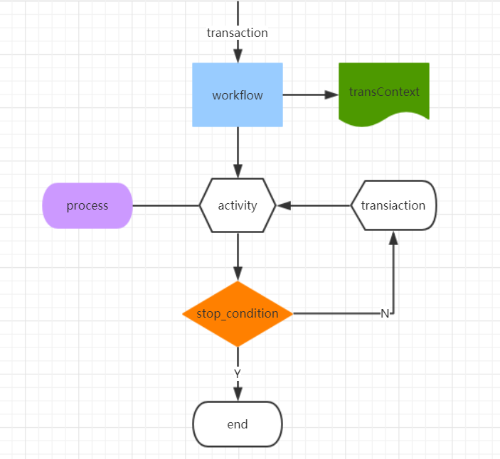

### 模型概念
#### workflow
workflow对应一次工作流，一次具体的工作流转状态，其中携带了流程运转的上下文信息。
#### transaction
transaction代表请求，它驱动了workflow的运转。一个或者多个transaction共同驱动workflow到达终态。
#### stop_condition
stop_condition代表终态条件，或者工作流结束状态，当执行完对应的操作后能与某一条stop_condition相匹配，则代表workflow可以达到停止状态。
#### activity
activity代表流程节点，workflow通过条件转换达到某个具体activity，通过activity完成此次事件变迁。
#### process
process挂载在activity下，它是activity的具体执行者，可以是下游外部系统的rpc调用，也可以是上下文信息的重组装。process是可以复用，也就是同一个process可以挂载在多个不同的activity下面。
#### transition
transition代表条件转换，每次执行完一个activity，上下文信息中保存了执行每个activity的处理结果和状态，通过状态的组合完成对transition的匹配，寻找下一个流程节点。
整体的流程概念如下图：
